# MultiverseContagion_parallel
This is a version of CovidSIMVL by Dr. Ernie Chang, modified for the purpose of demonstrating:
* many simulation instances being run in parallel
* nonparametric distributional representation to examine the collective behaviour of multiple simulations

Although this version is superseded, it is retained to demo findings from many runs executed in parallel. Theoretically everything is multiplatform, here the instructions demonstrated were tested on a Linux terminal 
# Files
## setup.sh
Install packages such as R, python, libv8

```sudo ./setup.sh``` 
## setup.R 

```sudo Rscript setup.R```

## run.R
Basic R interface to simulation

```Rscript run.R```

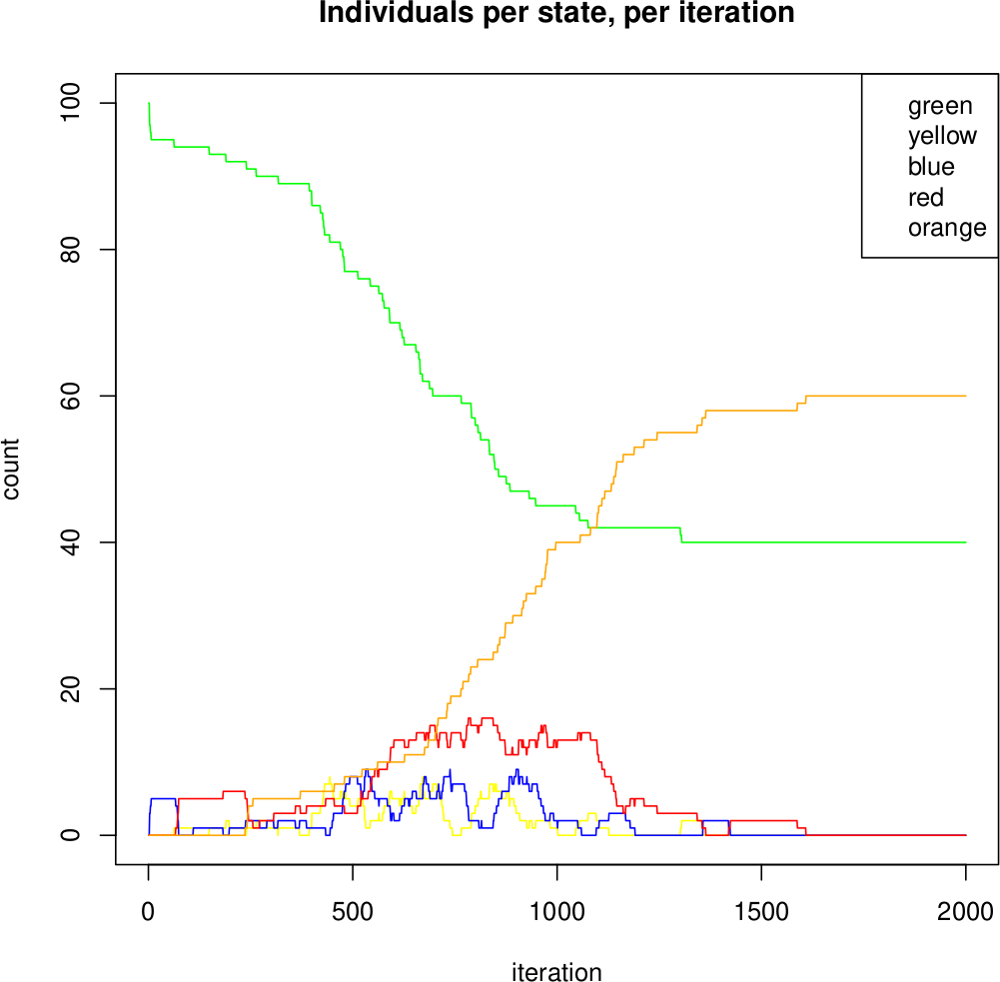

### run.R: simulation parameters exposed:
As in the run.R script:
```
if(length(args) == 0) stop("Rscript run.R [hazard radius] [mingle factor] [incubating] [presymptomatic] [symptomatic_cases] [simulation index]");
if(length(args) > 0) HAZARD_RADIUS = as.numeric(args[1])
if(length(args) > 1) MINGLE_FACTOR = as.numeric(args[2])
if(length(args) > 2) INCUBATING = as.numeric(args[3])
if(length(args) > 3) PRESYMPTOMATIC = as.numeric(args[4])
if(length(args) > 4) SYMPTOMATIC_CASES = as.numeric(args[5])
if(length(args) > 5) SIMULATION_INDEX = as.numeric(args[6])
```
the following parameters are exposed:
* HAZARD_RADIUS
* MINGLE_FACTOR
* INCUBATING (days incubation period from 0 days to INCUBATING)
* PRESYMPTOMATIC (case is presymptomatic from INCUBATING to PRESYMPTOMATIC)
* SYMPTOMATIC_CASES (case is symptomatic from PRESYMPTOMATIC to SYMPTOMATIC_CASES)

SIMULAION_INDEX is used when running the simulation automatically many times. If it is provided then plotting is waived

### varying the parameters

Changing **HAZARD_RADIUS** from 5 to 10:

```Rscript run.R 10```

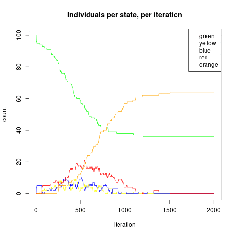

Increasing **MINGLE_FACTOR** from 1 to 10 (hazard radius is still 5):

```Rscript run.R 5 10```


Clearly increasing MINGLE_FACTOR also changes the intensity of the epidemic. For example, next varying **MINGLE_FACTOR** from 1 to 5, could result in a significantly delayed epidemic.How is this parameter behaving? Hard to tell with a stochastic simulation. We'll revisit this parameter change again after considering many simulation runs

```Rscript run.R 5 5```


Increasing the value of **INCUBATING** from 2.2 to 3.2 can also smear the epidemic: 

```Rscript run.R 5 1 3.2```


Increasing the value of **PRESYMPTOMATIC** from 5.2 to 7.2 can also have a stretching effect:

```Rscript run.R 5 1 2.2 7.2```


Increasing the value of **SYMPTOMATIC_CASES** from 13 to 15 can also have a stretching effect:

```Rscript run.R 5 1 2.2 5.2 15```


## run.py

Run the simulation many times in parallel. This invokes the R script a number of times and saves the result to csv for further use. For example, using the default parameters:
* HAZARD_RADIUS = 5.
* MINGLE_FACTOR = 1.
* INCUBATING = 2.2
* PRESYMPTOMATIC = 5.2
* SYMPTOMATIC_CASES = 13

and running 100 separate instances of the simulation (where the random number generator is always seeded differently on each run):

```
python3 run.py 5 1 2.2 5.2 13 100
```

## plot.py
This script takes the CSV files produced from run.py and produces plots with average trajectories for each state, and upper and lower bounds. In the future we would change this to +/- STDEV (instead of max, min). As in the previous section all comparisons are made to the "default" parameters, which we plot first:

```
rm *.csv # make sure there aren't any simulation traces kicking around
python3 run.py  5 1 2.2 5.2 13 100 
python3 plot.py 5 1 2.2 5.2 13 100 
```

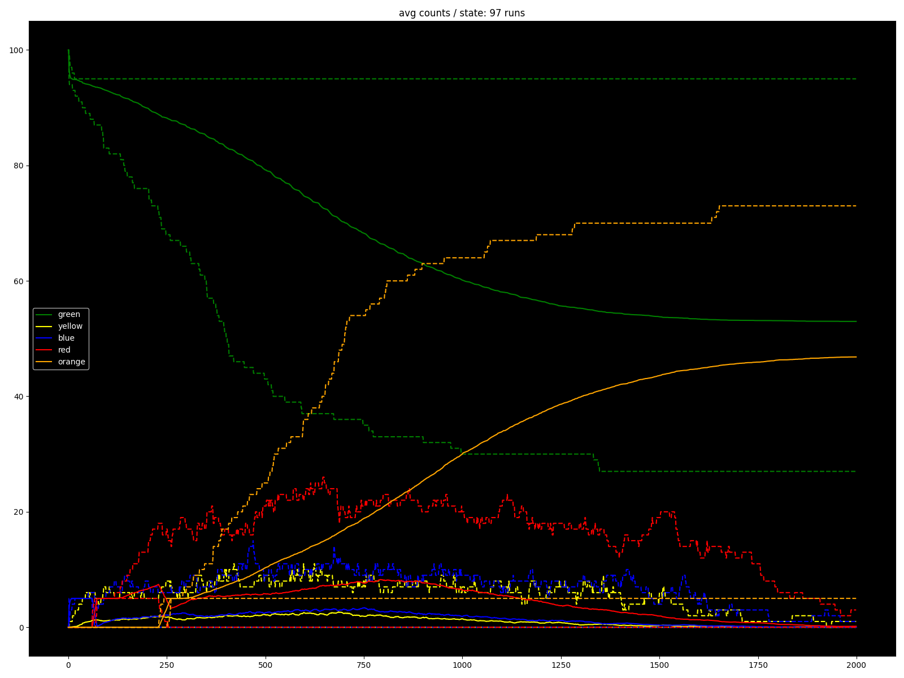

Changing **HAZARD_RADIUS** from 5 to 10 we note the same behaviour as before for the mean, an intensified epidemic:

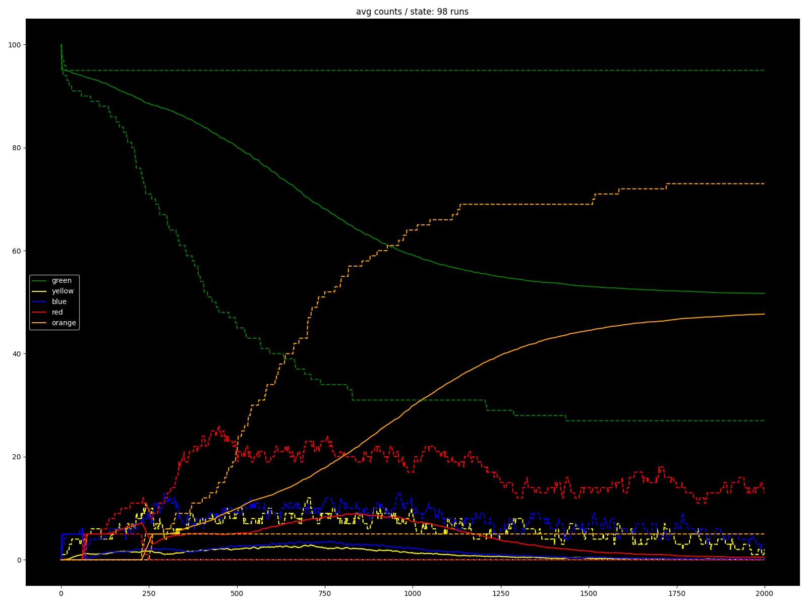

Increasing **MINGLE_FACTOR** from 1 to 10, again this gives a more intense epidemic:


Changing **MINGLE_FACTOR** from 1 to 5, this did flatten the epidemic out a bit, although perhaps not as dramatically as when considered a single iteration of the simulation: 


Increasing the value of **INCUBATING** from 2.2 to 3.2 didn't have as obvious an effect as it did before. Further investigation required


Increasing the value of **PRESYMPTOMATIC** from 5.2 to 7.2 had a bit of a flattening / stretching effect. Further investigation req'd


Increasing the value of **SYMPTOMATIC_CASES** from 13 to 15: again a flattening / stretching effect. Further investigation req'd. Probably need to change these parameters more to see a clearler change


## making comparison plots
How the above interlaced gifs were made:
```
convert -delay 100 plot_5_1_2.2_5.2_13_100.png plot_10_1_2.2_5.2_13_100.png plot_hzr_5_10.gif 
convert -delay 100 plot_5_1_2.2_5.2_13_100.png plot_5_10_2.2_5.2_13_100.png plot_mf_1_10.gif 
convert -delay 100 plot_5_1_2.2_5.2_13_100.png plot_5_5_2.2_5.2_13_100.png plot_mf_1_5.gif 
convert -delay 100 plot_5_1_2.2_5.2_13_100.png plot_5_1_3.2_5.2_13_100.png plot_inc_2.2_3.2.gif 
convert -delay 100 plot_5_1_2.2_5.2_13_100.png plot_5_1_2.2_7.2_13_100.png plot_pre_5.2_7.2.gif 
convert -delay 100 plot_5_1_2.2_5.2_13_100.png plot_5_1_2.2_5.2_15_100.png plot_sym_13_15.gif 
```

# plot_density.py
Because density estimation on grid, plots a surface, unlike in the above examples it's not possible to plot all five states on the same chart.

**green:**<br>
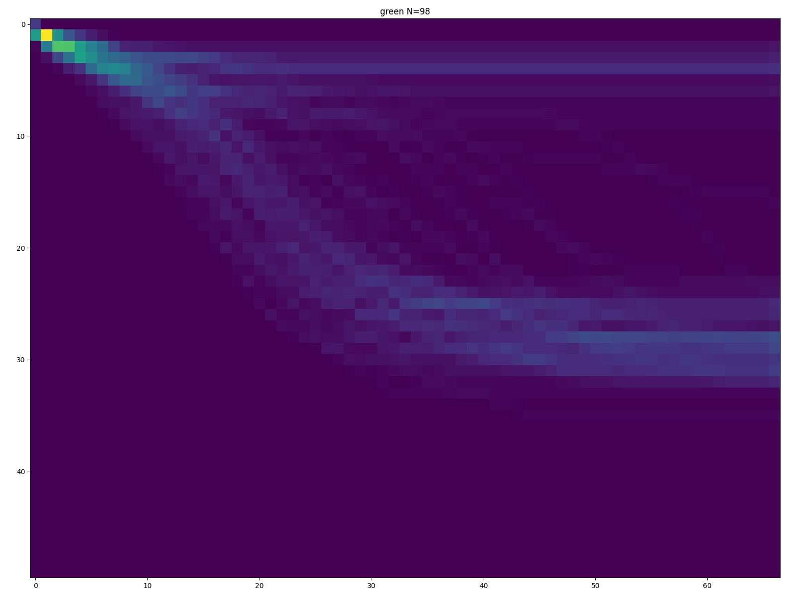

**yellow:**<br>


**blue:**<br>
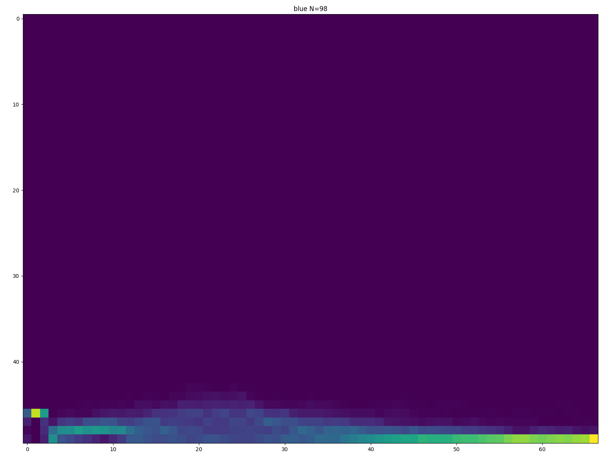

**red:**<br>


**orange:**<br>
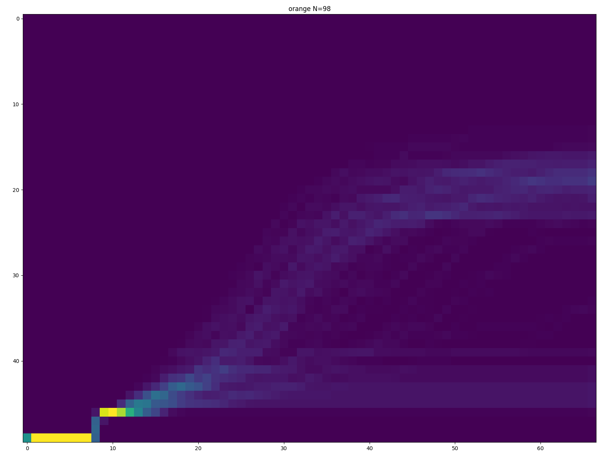

## changing HAZARD_RADIUS from 5 to 10

**green:**<br>


**yellow:**<br>
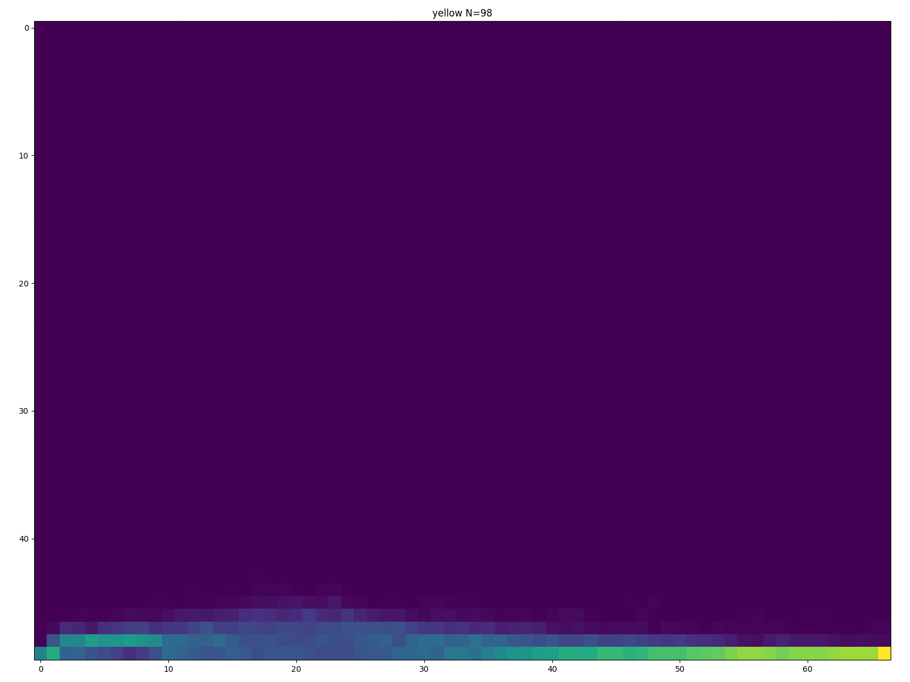

**blue:**<br>
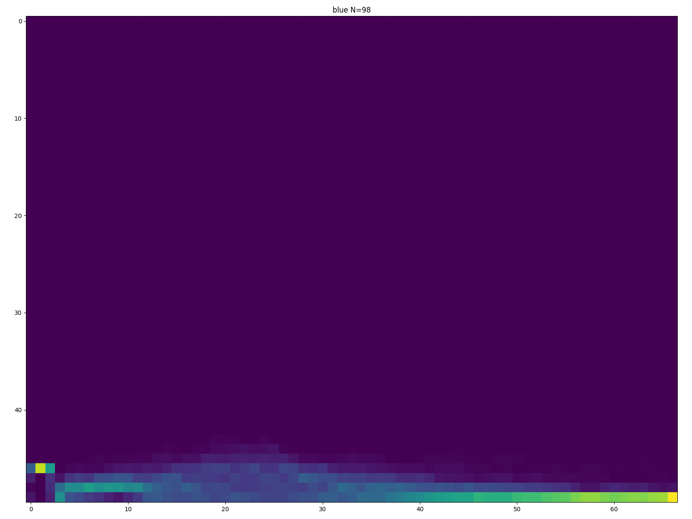

**red:**<br>


**orange:**<br>
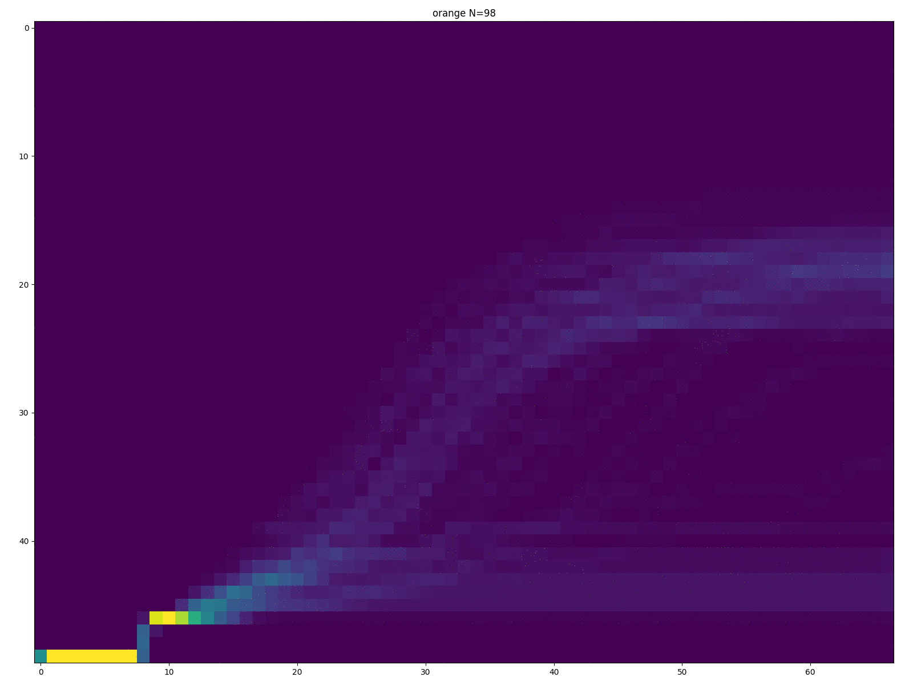

## changing MINGLE_FACTOR from 1 to 10

**green:**<br>


**yellow:**<br>


**blue:**<br>


**red:**<br>
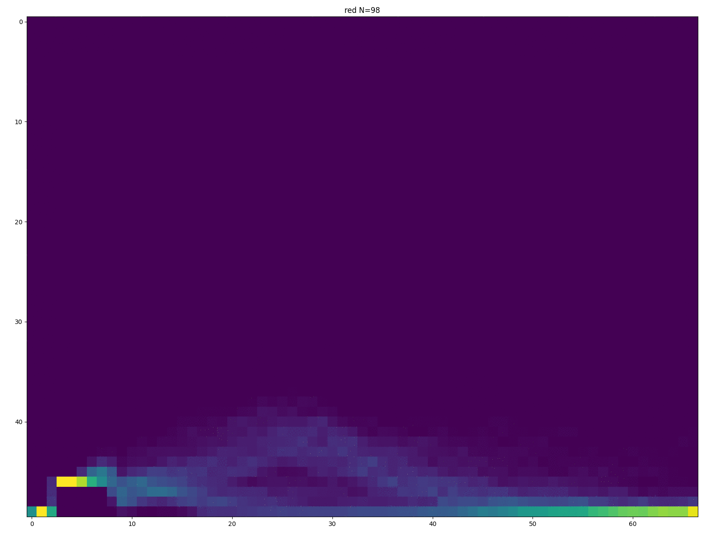

**orange:**<br>


## Quick Start 2021.02.15   Feb 15, 2021

THIS SITE HAS BEEN COMPLETELY RESTRUCTURED.
EVERYTHING TO DO WITH CovidSIMVL has been uploaded - the early and intermediate constructions, the projects, the powerpoints
Consider most of them archives 
There are 3 top-level folders:
     a. Documents
     b. PROJECTS
     c. Simulation Engines
     
Within /Simulation Engines, the PRIMARY CovidSIMVL contains the:

* index.html
* [the .js Javascript file](https://github.com/ecsendmail/MultiverseContagion/blob/master/CovidSIMVL/Simulation%20Engines/PRIMARY%20CovidSIMVL/CovidSIMVLvax.js)
* the two CSV files - one defining the population, the other the cases
* and an Excel sheet containing the sample outputs pasted from the console.log and screen images

read the _README.txt in the folders where you find them, especially in /Simulation Engines

In the /documents folder, the /Hnadbook directory has many versions as they have evolved. The latest is
just up to September 2020. It is not current but will give you an overall guide to starting and using the
system....


The Handbook has information useful to run and understand the goals of CovidSIMVL.


The use of AUTO will keep going, hour by hour
Pressing the AUTO button again will put the system back into manual mode.

The Multiverse can be invoked by double-clicking the MV button (top left)....
Within it is a button labeled "TRAFFIC". To get out of it you need to DOUBLE-CLICK the red "STOP/EXIT"

CAVEAT - as it sits, we assume you know something about browsers, devtools, console.logs, WATCH variables of
interest, and so on if you are intending to run or modify COvidSIMVL.

LICENSE - CovidSIMVL is in the public domain, and available for your download, use, modification and distribution under the terms of
the GNU License Open Software framework.

Many may just use the /Documents folder as a resource for information about this particular agent-based simulation space, and
the manuscripts, notes, and powerpoint presentations created around CovidSIMVL as tool and sandbox for exploration, and as an
instrument for the detailed study of contagion-based epidemics.


## Quick Start: run simulation in R (tested on ubuntu)
1. run:

```
sudo ./setup.sh
```

2 run:

```
Rscript run.R
```


